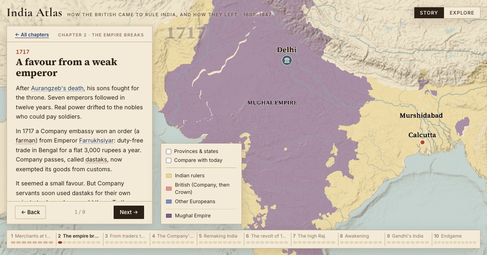

# India Atlas

**How the British came to rule India, and how they left · 1600–1947**

[](https://nameetrajore.github.io/india-atlas/)

A map-based story of British rule in India, told in 10 chapters and 91 scenes. Each scene moves the map to a moment in time and shows only what the narrative references.

**→ [Open the atlas](https://nameetrajore.github.io/india-atlas/)**

## Three ways in

- **Story.** Read the chapters scene by scene. Names in the text link to cards on the map.
- **Explore.** Scrub a timeline that zooms from centuries to days and click anything. Scroll to zoom, drag to pan, Space to play, ←/→ to step.
- **Follow a person.** Step through the lives of 11 figures, from Thomas Roe to Jinnah, on a travelling map.

Also: **Then vs now** (a draggable divider shows present-day boundaries beside the historical map, camera-locked), **charts** of economic series such as railway kilometres, and a **[Sources & methods](https://nameetrajore.github.io/india-atlas/?page=methods)** page listing open doubts and map gaps.

## Chapters

| # | Chapter | Period | Scenes |
|---|---|---|---|
| 1 | [Merchants at the Mughal court](https://nameetrajore.github.io/india-atlas/?ch=1) | 1600–1707 | 8 |
| 2 | [The empire breaks](https://nameetrajore.github.io/india-atlas/?ch=2) | 1707–1757 | 9 |
| 3 | [From traders to rulers](https://nameetrajore.github.io/india-atlas/?ch=3) | 1757–1772 | 9 |
| 4 | [The Company's wars](https://nameetrajore.github.io/india-atlas/?ch=4) | 1772–1818 | 9 |
| 5 | [Remaking India](https://nameetrajore.github.io/india-atlas/?ch=5) | 1818–1857 | 9 |
| 6 | [The revolt of 1857](https://nameetrajore.github.io/india-atlas/?ch=6) | 1857–1858 | 9 |
| 7 | [The high Raj](https://nameetrajore.github.io/india-atlas/?ch=7) | 1858–1905 | 9 |
| 8 | [Awakening](https://nameetrajore.github.io/india-atlas/?ch=8) | 1905–1919 | 9 |
| 9 | [Gandhi's India](https://nameetrajore.github.io/india-atlas/?ch=9) | 1919–1939 | 9 |
| 10 | [Endgame](https://nameetrajore.github.io/india-atlas/?ch=10) | 1939–1947 | 11 |

## By the numbers

| | |
|---|---|
| Events | 169, each with context, consequences and cause → effect links |
| People | 75 (11 with step-through journeys) |
| Polities / border keyframes | 69 / 58, drawn on 625 admin units from the 1941 census |
| Railways / trade routes | 110 segments (1853–1947) / 12 routes with moving cargo |
| Sources | 315; every record cites at least one |

## Every view is a URL

| URL | Opens |
|---|---|
| `?ch=1&sc=8` | A story scene |
| `?mode=explore&t=1919.28&sel=event:jallianwala&today=1` | Explore at a moment, with a selection and Then vs now |
| `?journey=gandhi&step=3` | A journey step |
| `?page=methods` | Sources & methods |

## Run locally

```sh
npm install
npm run dev
```

| Command | Does |
|---|---|
| `npm run dev` | Compile content, start Vite |
| `npm run content` | Validate `content/` and write `public/data/content.json` |
| `npm run build` | Content + type-check + Vite build + per-chapter share pages |
| `npm run lint` | ESLint |
| `npm run base` | Rebuild `public/data/base/*.geojson` (needs `uv`; run `scripts/fetch_raw.sh` first) |

Pushes to `main` deploy to GitHub Pages via `.github/workflows/pages.yml`.

## How it works

**Content as code.** All historical data is YAML under `content/`. `scripts/build-content.ts` validates it with strict zod schemas, checks every cross-reference and source citation, and compiles one `content.json` that the app loads at startup. Invalid content fails the build.

- **Borders** are sets of 1941 admin units per polity per keyframe (`territory.yaml`). The first keyframe assigns every unit; later ones list only changes. Unassigned units render as "not yet mapped" rather than guessed.
- **Dates** are `YYYY`, `YYYY-MM` or `YYYY-MM-DD`, optionally `approx`. In the app, time is a fractional year.
- **Scenes** set time, camera, text and an explicit `show` list of what appears on the map.
- **Causality is data.** Events link through `causes` and `led_to`.

**Stack.** React 19 + TypeScript + Vite, MapLibre GL with deck.gl layers, Zustand state synced both ways with the URL.

| Path | What |
|---|---|
| `content/` | Chapters, events, people, places, polities, territory, railways, trade, sources |
| `scripts/build-content.ts` | Schemas and the content compiler |
| `src/lib/derive.ts` | The world at time *t*: who controls each unit, where each person is, which places matter |
| `src/map/` | Base style, deck.gl layers, label declutter, present-day comparison map |
| `src/ui/` | Story player, timeline, cards, journeys, charts, search |
| `docs/decisions.md` | Numbered design decisions (D1–D27) |

## Editing content

1. Add or edit records in `content/` (events go in `content/events/<chapter>.yaml`, scenes in `content/chapters/`).
2. Cite at least one source id from `content/sources/` on every record.
3. Link entities in scene text as `[label](event:id)`, `(place:id)`, `(person:id)` and so on.
4. Run `npm run content`. It fails on unknown keys, broken references or missing sources.

A new field needs both the zod schema in `scripts/build-content.ts` and the type in `src/types.ts`. Significant product changes get a new numbered entry in `docs/decisions.md`.

## Caveats

- AI wrote the content and AI checked it. No historian has reviewed it yet. Open doubts are on the [Sources & methods](https://nameetrajore.github.io/india-atlas/?page=methods) page.
- Contested history uses period names with modern equivalents and sourced ranges for disputed figures. The atlas gives no verdicts.
- Outside present-day India (Pakistan, Bangladesh, Burma), present-day districts stand in for 1941 units, so borders there are approximate.
